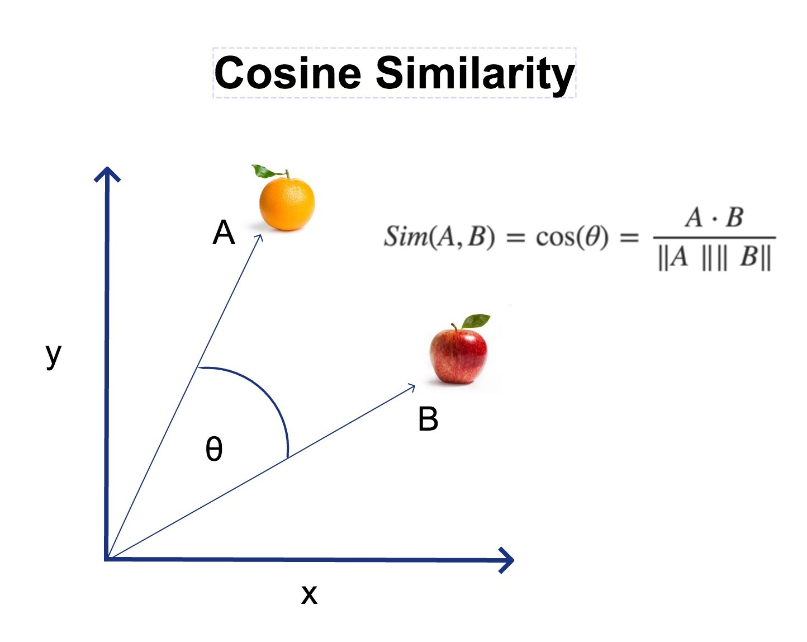

# 🍿 CineMatch

**CineMatch** is a content-based movie recommendation app that helps users discover their next favorite films based on what they already like — or by filtering their preferences like genre, cast, director, and more.

---

## 📌 Project Overview

CineMatch is a smart and visually engaging movie recommender system built with Streamlit. It supports two core use cases:

1. **Content-Based Recommendation** – Type a movie title and get similar movies using NLP and cosine similarity.
2. **Filter by Preferences** – Explore movies interactively based on genre, cast, director, runtime, and release year.

This project demonstrates end-to-end data wrangling, machine learning, and web deployment in a user-friendly interface.

---

## 🎯 Business Problem

Modern viewers are overwhelmed by streaming content. CineMatch solves this by recommending movies based on content similarity or filter-based browsing, helping users spend less time searching and more time watching.

---

## 📦 Data Source

Data is collected from [TMDb (The Movie Database)](https://www.themoviedb.org/), including:
- Titles, overviews, genres, cast, director
- Runtime, release date, vote counts
- Posters (via TMDb image URL pattern)

APIs used:
- TMDb API (`requests`)
- Supplementary data cleaned from `.csv` sources

---

## 🧹 Data Wrangling and Cleaning

- Removed exact and near-duplicate titles
- Normalized text fields (genres, cast, keywords)
- Converted lists in strings using `ast.literal_eval()`
- Converted release dates to datetime
- Dropped invalid or null rows
- Added lemmatization and lowercasing for consistent tags

---

## 🔍 Exploratory Data Analysis (EDA)

- Distribution of genres and popularity
- Frequency of top cast/directors
- Vote counts and average ratings
- Runtime histograms and outliers

---

## 🧠 Machine Learning Key Concepts

---

### 🔤 TF-IDF Vectorization (Text to Numbers)

**TF-IDF** stands for **Term Frequency–Inverse Document Frequency**. It's a classic NLP technique used to convert text into numbers so that a machine can understand and compare them.

In this project, we used it to transform each movie’s textual metadata into a numerical vector.

#### 🔍 How It Works:
- TF-IDF gives **higher weight** to words that are **unique** to a movie.
- It gives **lower weight** to common words like "the", "movie", or "film".
- Fields like `title`, `overview`, `genres`, `keywords`, `cast`, and `director` were combined into a single text field called `tag`.
- The `tag` is then vectorized into numbers using `TfidfVectorizer`.

> Each movie ends up as a vector (list of numbers) that reflects the importance of words in describing it.

---

### 📐 Cosine Similarity (Compare the Meaning)

Once we have all movie tags converted into vectors, we use **cosine similarity** to compare them.

#### 📏 What is Cosine Similarity?
It measures the **angle** between two vectors:
- A **small angle** means the movies are similar → **high similarity score (close to 1.0)**
- A **large angle** means the movies are less similar → **low score (close to 0.0)**
### 🧠 Cosine Similarity Visualized



> This helps us **find other movies with similar content**, even if they don’t share the exact same words.

---

### 🔄 Putting It All Together in CineMatch

1. The user selects a movie (e.g. _Inception_).
2. CineMatch:
   - Finds the vector for that movie’s `tag`.
   - Compares it with all other movie vectors using cosine similarity.
   - Sorts them from most similar to least similar.
3. The top 5 most similar movies (excluding the selected one) are returned as **recommendations**, each with poster, rating, and overview.

---

> ✅ This is known as a **Content-Based Recommender**, because it uses only the movie's content to make suggestions — not user ratings or behavior.

---

## 🛠 Methodology

- Combined multiple text features into a `tag` field: `title + overview + genres + keywords + cast + director`
- Used `TfidfVectorizer` to convert the `tag` into a numerical vector
- Computed pairwise cosine similarity matrix
- Saved as `cosine_sim.pkl` for performance

---

## 🌐 Streamlit Application

### App Features
- 🔍 **Find Similar Movies**: type a movie title, get top 5 similar movies
- 🎛️ **Filter by Preferences**: explore by genre, cast, director, year, runtime
- 🎞️ Clean UI with movie posters, ratings, overviews
- 🖼️ Banner GIF and interactive layout with sidebar navigation

### Run the App

```bash
streamlit run app/app.py

---

## 🛠️ Tools & Technologies

- **Python**: pandas, scikit-learn, numpy, matplotlib, seaborn
- **Natural Language Processing**: nltk, TfidfVectorizer
- **Web App**: Streamlit
- **Data**: TMDb API (The Movie Database)
- **Version Control**: Git & GitHub
- **Visualization**: matplotlib.pyplot, seaborn, plotly.express

> 🔧 Additional exploration and prototyping done in Jupyter Notebook

---

## ✨ About the Author

**Rebecca Woo**  
📊 Business & Data Analyst | Where Data Meets Design  

---
